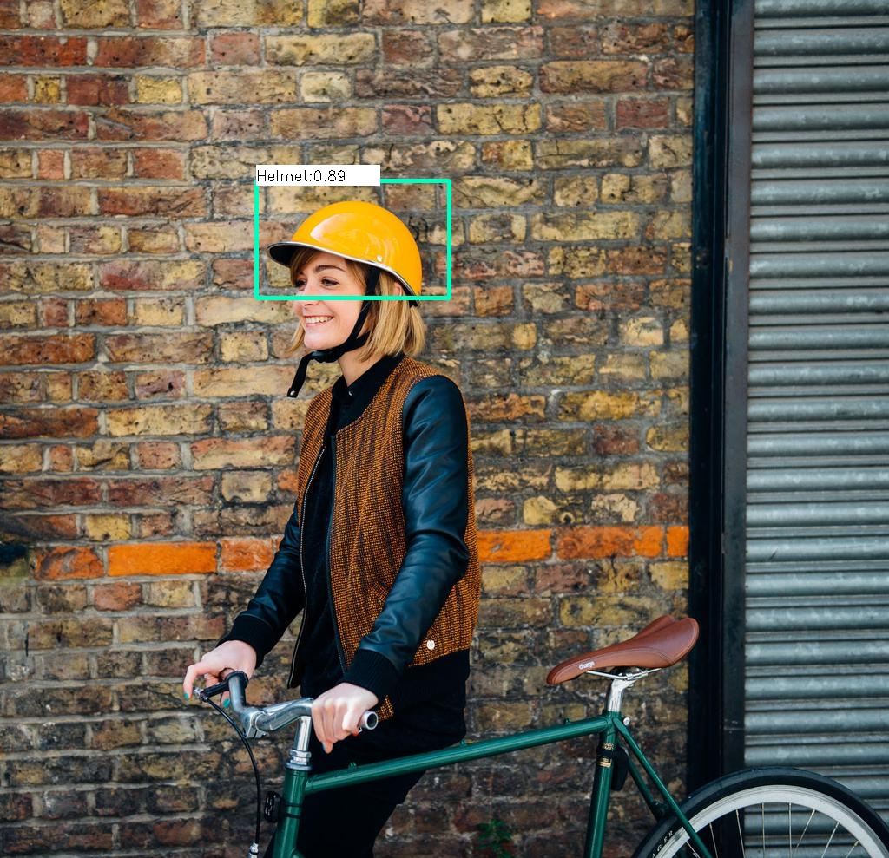

# helmet_object_hack4tk from Team ECC

IMAGE/VIDEO/LIVE Detector for TIM RUPP, 

demo code. Out-of-box ready. 



#### 0. Utility:

code is minimized with openCV DNN read from darknet, and enough platform-freedom
pretained model provided

detection in image:
```
python3 Helmet_detection_YOLOV3.py -i ./test_input/test_working_helmet.jpg
```

detection in video:
```
python3 Helmet_detection_YOLOV3.py -v ./test_input/helmet.mp4
```

detection in webcam live:
```
python3 Helmet_detection_YOLOV3.py -c
```
there are flag in code you can set: 
for live demo effect
1) visual_result
2) save_result
3) resize_factor  


#### 1. Envirnment (virtualenv) depedencies or not

pip install -r requirements.txt

#### 2. Model problem

This model is our hackathon model, it works fine. but it has its own problem for it greatly mis-classficates human hair to Helmet.
this can be removed by deeper training with more datasets and took a care on data augumentation.
made search on helmet open datasets the chinese one in is the best, I wanted to do a good model for TIM RUPP for submission but unfornately, till you are facing LIVE demo I am still not able to get any time for that. (I am very sorry, but to make a detect refinement on this model, the training at least need to run 40 hours + on GPU)

fine-tuning: darknet
https://github.com/wujixiu/helmet-detection (this one offeres other networks pretain model too)

But to address the performance during hackathon, YOLOv3 was choosen.

#### 3. if you wanna refine the model with your own data

training module: https://github.com/AlexeyAB/darknet

a handy labelling tool: https://github.com/AlexeyAB/Yolo_mark

#### silly comments,

webcam code is i blinded coded for i have no webcam now, not likely it will have bug, but maybe
